# CI/CD Pipeline 

## Understanding CI, CD, and Continuous Deployment (CD)
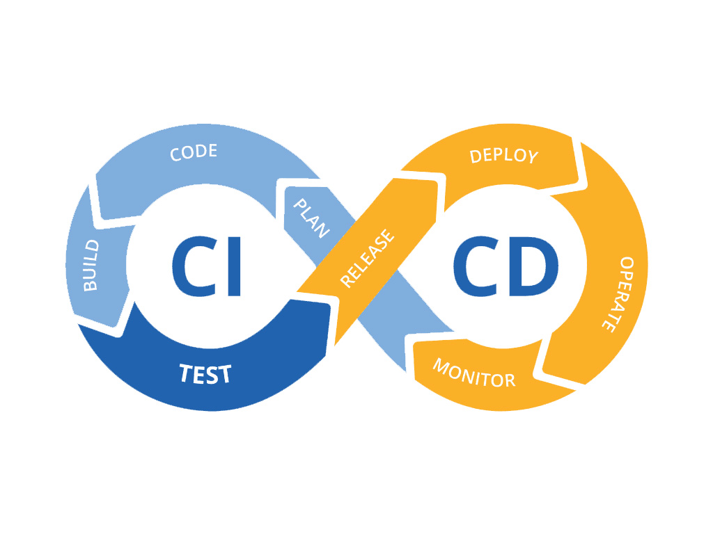
### Continuous Integration (CI)

Continuous Integration is a development practice where developers frequently integrate their code changes into a shared repository. Each integration triggers automated build and test processes to detect errors quickly.
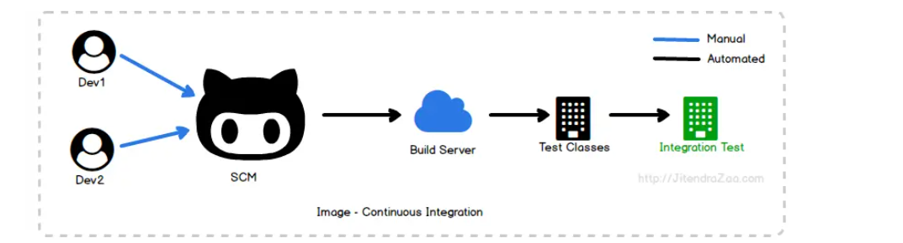

### Continuous Delivery (CD)

Continuous Delivery extends CI by automating the deployment process, allowing teams to release software updates to production or staging environments quickly and reliably.
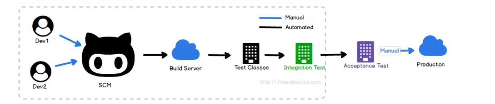

### Continuous Deployment (CD)

Continuous Deployment takes CD one step further by automatically deploying every code change that passes through the CI/CD pipeline to production environments without manual intervention.
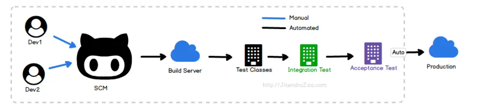

## What is a CI/CD Pipeline?

A CI/CD pipeline automates the integration of code changes into a shared repository (Continuous Integration) and the deployment of applications to production environments (Continuous Deployment/Delivery). Jenkins is a popular open-source automation server often used to implement CI/CD pipelines.

## Why CI/CD?

- **Efficiency**: Automation reduces manual errors and speeds up software delivery.
- **Scalability**: Jenkins allows the scaling of CI/CD processes across multiple agents and environments.
- **Flexibility**: Integration with AWS enables deployment to cloud infrastructure easily.

## When to Use CI/CD?

CI/CD pipelines are essential for any project, especially:
- **Large Teams**: Facilitates collaboration among multiple developers.
- **Frequent Releases**: Enables rapid iteration and continuous delivery.
- **Cloud Deployment**: Integrates seamlessly with cloud platforms like AWS.

## How CI/CD Works with Jenkins, Agents, and AWS?


1. **Code Commit**: Developers push code changes to a version control system like Git.
2. **Continuous Integration (CI)**:
   - **Jenkins Master**: Jenkins coordinates the CI/CD process.
   - **Agent Nodes**: Jenkins agents (running on separate machines or containers) execute build and test tasks.
   - **Build & Test**: Agents pull code from the repository, build the application, and run automated tests.
3. **Continuous Deployment (CD)**:
   - **AWS Integration**: Jenkins interacts with AWS services for deployment.
   - **Deployment Pipeline**: Jenkins pipelines define stages for deploying to different environments (e.g., staging, production).
   - **Deploy to AWS**: Deploy application artifacts to AWS services like EC2. 
4. **Monitoring and Feedback**: Continuous monitoring of application performance and user feedback loop to inform future development iterations.

# Setting Up CI/CD Pipeline Using Jenkins for Node.js Project

## Create a New Jenkins Project

1. Navigate to Jenkins dashboard.
2. Click on "New Item" to create a new project.
3. Enter a name for the project.
4. Select the project type, Freestyle project
5. Click "OK" to create the project.

## Link Your GitHub Repository

1. Enter the URL of your GitHub repository.
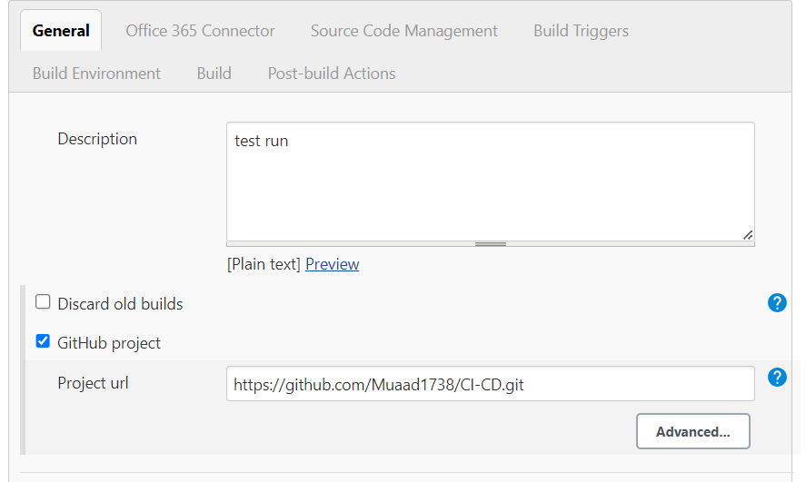

## Choose Where This Project is Going to Run

- We are going to use Sparta-ubuntu-node. This will have ubuntu and node installed.


## Source Code Management

1. In the project configuration, ensure that Git is selected as the SCM.
2. Link your git repo ssh link.
3. Create a new and add your private ssh key.
4. Configure branches to build as needed (e.g. main branch).
5. Save the configuration.

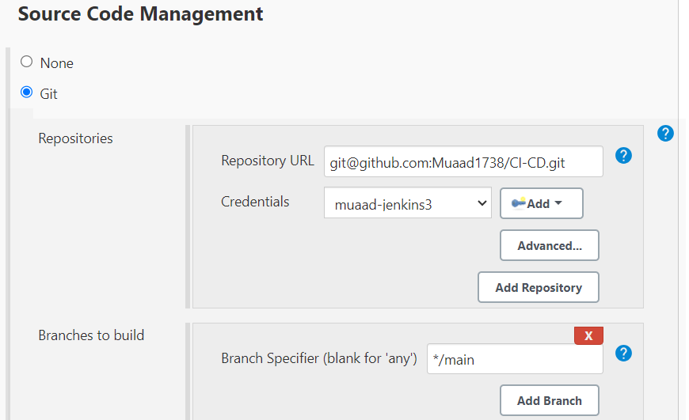

## Add a Webhook and Link It

1. In your GitHub repository settings, navigate to "Webhooks".
2. Click on "Add webhook" or "Create webhook".
3. Enter the Payload URL (Jenkins webhook URL).
4. Choose the events to trigger the webhook (e.g., push events).
5. Save the webhook configuration.

    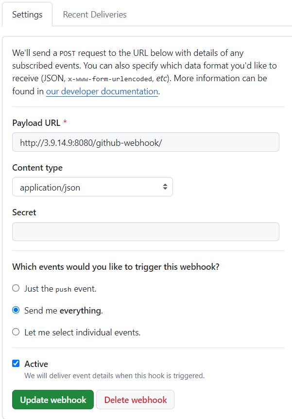

## Specify the Node.js and npm Folders

1. In the project configuration, go to "Build Environment" section.
2. Set environment variables.
3. Save the configuration.
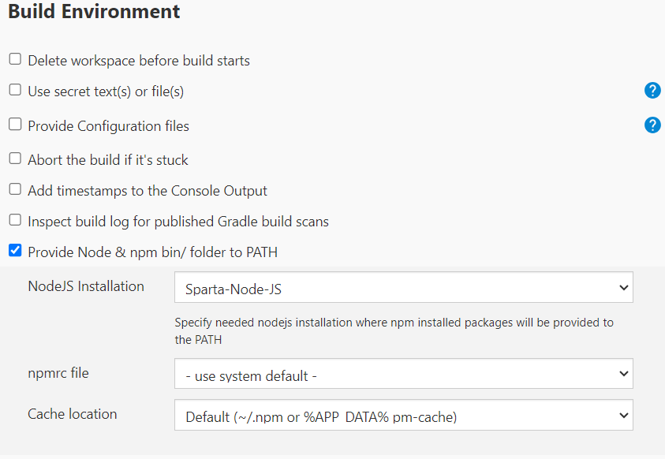

## Build the App Using Shell Commands

1. In the project configuration, go to "Build" section.
2. Choose "Execute shell" as the build step.
3. Enter the shell commands to build your Node.js application.
4. Example:
    ```bash
    cd app
    npm install
    npm test
    ```
5. Save the configuration.

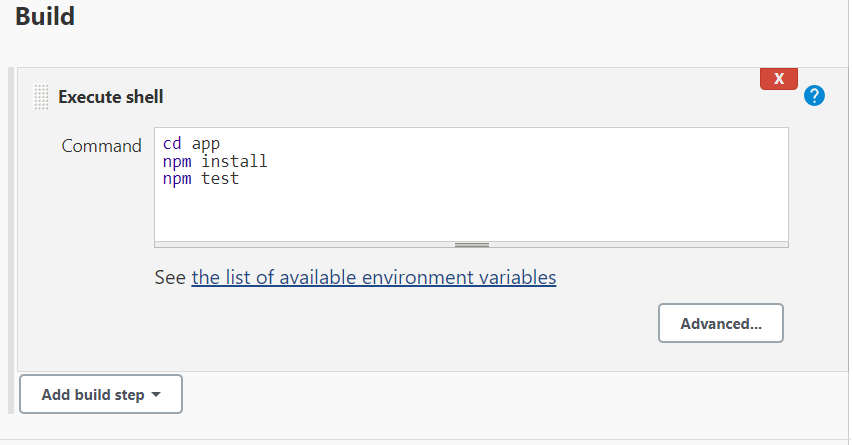
## Run the Jenkins Job

1. Trigger the Jenkins job manually or wait for the webhook to be triggered.
2. Monitor the build progress in the Jenkins dashboard.
3. If the build is successful, proceed with deployment or other post-build actions.

## Conclusion

Successfully set up a CI/CD pipeline using Jenkins for your Node.js project! Jenkins will now automatically build and test your application whenever changes are pushed to your GitHub repository.


## CI/CD Pipeline
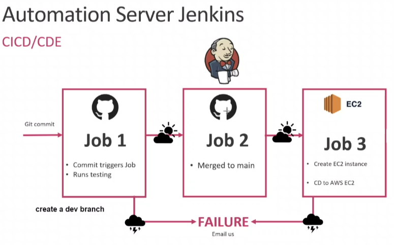

Continuous Integration (CI) and Continuous Deployment (CD) are crucial practices in modern software development, ensuring that code changes are tested, integrated, and deployed efficiently and reliably. 

- Job 1: Code Integration and Testing: This job pulls code changes from GitHub dev branches and executes tests to verify integration and code quality. It's triggered automatically via webhook upon code changes, ensuring frequent validation of new code against existing standards.

- Job 2: Main Branch Integration and Testing: This task merges validated changes into the main branch and conducts additional tests to affirm stability. By continuously validating the main branch, it ensures that the codebase remains reliable and deployable.

- Job 3: Deployment to EC2: Responsible for deploying the Node.js app onto an EC2 instance, this job automates the deployment process, guaranteeing reliable and repeatable deployment of thoroughly tested code. It completes the CD pipeline, delivering changes to a production-like environment efficiently.

 By implementing CI/CD with Jenkins, teams can achieve faster time-to-market, higher quality software releases, and improved collaboration among development, testing, and operations teams.

### Continuous Integration (CI)

#### Create Development Branch 
``` bash 
git checkout -b dev    
git push origin dev
```
### Merge Code from Development to Main Branch
- Configure Jenkins to use your Git repository and specify the dev branch.
  
- Scroll down to the "Post-build Actions" section and click on "Add post-build action".
    - Select "Git Publisher".
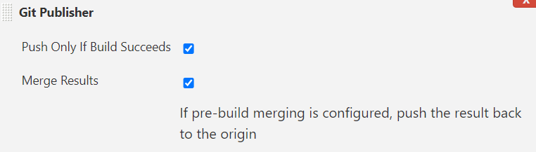
- Check the box for "Merge before build".
  - Set the "Branch to merge to" as main.
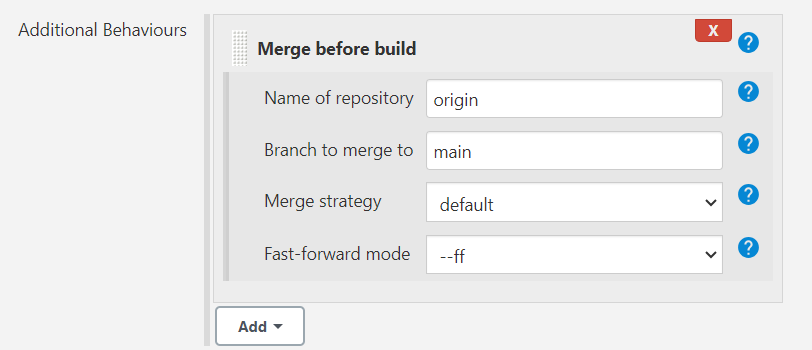

## Setting Up Production Environment on EC2

To create a production environment on Amazon EC2, follow these steps:

1. **Launch EC2 Instance:**
   - Choose the "Ubuntu Server 18.04 LTS" 

2. **Configure Security Group:**
   - Configure inbound rules to allow traffic on the following ports:
     - Port 22 (SSH) for remote access to the instance.
     - Port 8080 for Jenkins.
     - Port 3000 for Node.js applications.
     - Port 80 for HTTP traffic.

## Using EC2 Instance and Jenkins

Outlines the steps for setting up using an EC2 instance and Jenkins.

### Provisioning EC2 Instance
Use Jenkins to run this build with setting up the nginx server.

```bash
ssh -o "StrictHostKeyChecking=no" ubuntu@54.171.88.247 << EOF
sudo apt-get update
sudo apt-get upgrade -y
sudo apt-get install nginx -y
sudo systemctl enable nginx
EOF
```
This section provisions an EC2 instance and installs Nginx web server on it. 
```bash
rsync -avz -e "ssh -o StrictHostKeyChecking=no" app ubuntu@54.171.88.247:/home/ubuntu
rsync -avz -e "ssh -o StrictHostKeyChecking=no" environment ubuntu@54.171.88.247:/home/ubuntu
```
This section deploys the application files and environment configuration to the EC2 instance.

SSH into your EC2 instance manually and run the following commands 

```bash
# Install Node.js 10.x from the NodeSource repository
curl -fsSL https://deb.nodesource.com/setup_10.x | sudo DEBIAN_FRONTEND=noninteractive -E bash - && sudo DEBIAN_FRONTEND=noninteractive apt-get install -y nodejs

# Install npm package manager
sudo apt install npm -y

# Navigate to the app directory
cd app

# Install dependencies using npm
npm install

# Install PM2 globally using npm
sudo npm install pm2 -g

# Stop the PM2-managed Node.js app
pm2 stop app

# Start the Node.js app using PM2
pm2 start app.js
```
This section installs Node.js, npm, and other dependencies required for the application. It then starts the application using PM2 process manager.

Once all dependencies are installed manually, modify your script for the build to run on jenkins server. 

- Make sure the SSH agent is linked so jenkins can go into your EC2 instance. 
  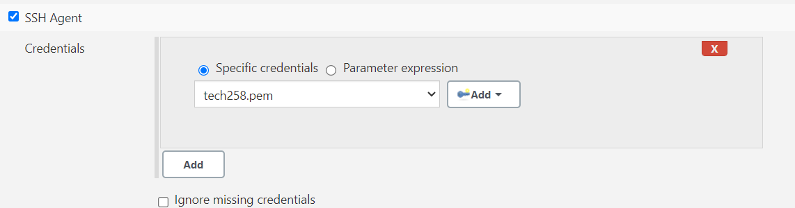
- Add your shell commands in the build section.
  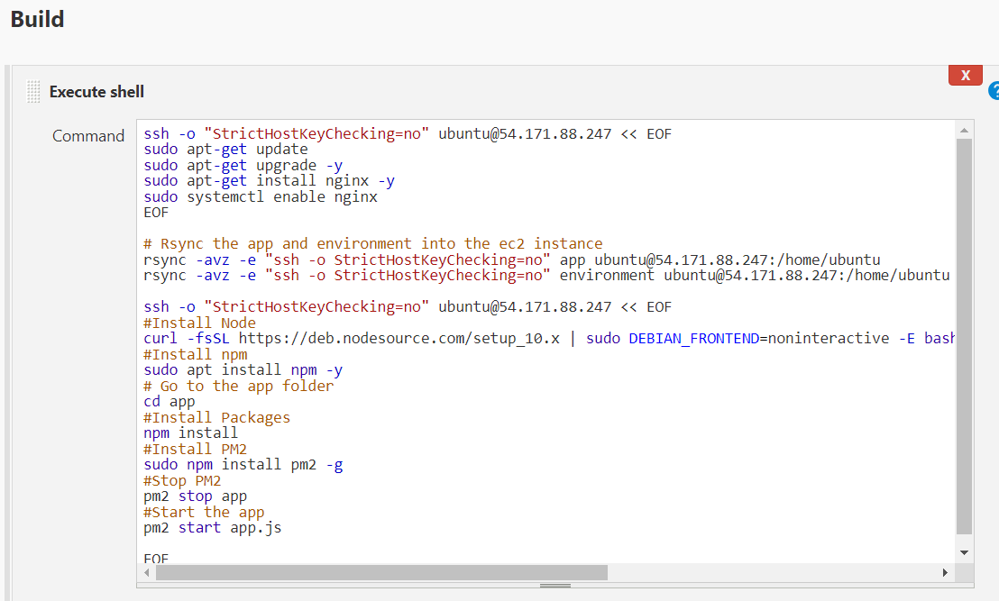

Run your build and and your app should be working. 

